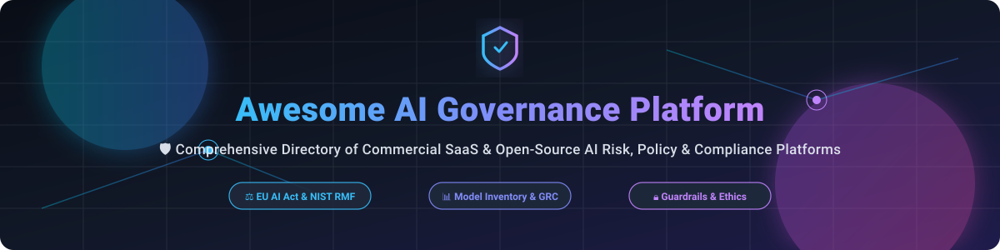

# 🛡️ Awesome AI Governance Platform

  
  
  
  

> **A curated, audit-ready directory of enterprise SaaS platforms and open-source GitHub projects for AI Governance, Policy Management, Model Inventory, Risk Assessment, and Responsible AI Compliance.**

---

## 🔍 Overview & Key Keywords

Welcome to the **Awesome AI Governance Platform** repository! This resource tracks leading commercial **SaaS platforms** and **open-source tools** engineered to help enterprises, risk officers, and engineering teams inventory AI systems, enforce organizational policy, assess model risks and bias, document decisions, and generate compliance evidence for regulatory frameworks like the **EU AI Act**, **NIST AI Risk Management Framework (RMF)**, and **ISO/IEC 42001**.

---

## 📑 Table of Contents

- [📈 Market Overview](#-market-overview)
- [🏢 Enterprise SaaS Platforms](#-enterprise-saas-platforms)
- [📦 Open-Source GitHub Projects](#-open-source-github-projects)
- [🛠️ Key Governance Building Blocks](#%EF%B8%8F-key-governance-building-blocks)
- [🤝 How to Contribute](#-how-to-contribute)
- [⚖️ Disclaimer](#%EF%B8%8F-disclaimer)

---

## 📈 Market Overview

📈 **Sector Dynamics**: The global **AI Governance software market** is estimated at **~$450 Million in 2024** and is projected to expand to **~$3.2 Billion by 2030** (CAGR ~38%). The sector is currently **highly fragmented**, characterized by legacy enterprise cloud & GRC giants (Microsoft, IBM, SAS, DataRobot) competing alongside specialized pure-play AI governance startups (Credo AI, Holistic AI, Fiddler AI) and open-source risk frameworks.

---

## 🏢 Enterprise SaaS Platforms

Below is a curated table of enterprise AI governance platforms, sorted by **Company Size (Revenue / Valuation)** in descending order.

| 🏢 Platform | 📝 Description | 💰 Starting Price | 🎁 Free Tier / Trial Limit | 📊 Company Size (Valuation / Revenue) |
| :--- | :--- | :--- | :--- | :--- |
| **Microsoft AI Governance** | Azure AI Purview & AI Governance suite for data lineage, policy enforcement, and compliance tracking across enterprise workloads. | $0.40 / 1,000 requests (or $100/mo base capacity unit) | $200 free Azure credits for 30 days (includes 5GB storage & 10k transactions) | ~$245 Billion Annual Revenue ($3.1 Trillion Valuation) |
| **IBM watsonx.governance** | Comprehensive enterprise AI governance platform for policy enforcement, automated lifecycle lineage, and regulatory audit readiness. | $0.60 per Resource Unit ($1,500/mo enterprise base) | 30-day Free Trial with 10,000 Resource Units included | ~$62 Billion Annual Revenue ($170 Billion Valuation) |
| **SAS AI Governance** | Integrated model risk management, policy controls, and regulatory audit workflows built into the SAS Viya cloud platform. | $1,250/month per user | 14-day Free Trial of SAS Viya with full AI governance suite access | ~$3.2 Billion Annual Revenue |
| **TruEra (Snowflake)** | RAG & LLM evaluation, observational guardrails, and automated governance tracking deeply integrated into Snowflake. | $2.00 per Snowflake Credit ($250/mo minimum spend) | 30-day Free Trial with $400 in free evaluation credits | ~$3.0 Billion Annual Revenue ($50 Billion Valuation) |
| **DataRobot Governance** | Automated AI compliance documentation, model registries, approval workflows, and continuous model drift monitoring. | $2,500/month Starter Subscription | 14-day Free Trial with full AI governance workbench access | ~$6.3 Billion Peak Valuation (~$300M Revenue) |
| **Fiddler AI** | Enterprise AI observability, continuous model monitoring, safety guardrails, and compliance reporting platform. | $500/month Starter Plan | Free Developer Tier up to 10,000 predictions/month (or 14-day Enterprise Trial) | ~$250 Million Valuation ($32M+ VC Raised) |
| **Credo AI** | End-to-end Responsible AI platform for policy mapping, automated risk assessments, and GRC regulatory compliance workflows. | $3,333/month ($40,000/year base platform plan) | 14-day Guided Sandbox Free Trial upon request | ~$120 Million Valuation ($39M VC Raised) |
| **CalypsoAI** | Enterprise LLM security, prompt red-teaming, real-time policy enforcement, and AI governance audit logging. | $1,000/month Team Tier | 14-day Free Sandbox Trial with 5,000 free prompt scans | ~$100 Million Valuation ($38M VC Raised) |
| **Holistic AI** | Comprehensive AI risk management, fairness documentation, bias auditing, and EU AI Act compliance suite. | $1,500/month Base Compliance Suite | 14-day Free Audit Sandbox Trial | ~$90 Million Valuation ($20M VC Raised) |
| **ModelOp** | Enterprise Model Risk Management (MRM) software focusing on model inventory, validation workflows, and executive board reporting. | $2,000/month Starter Tier | 30-day Proof-of-Concept Free Trial for up to 5 model inventories | ~$75 Million Valuation ($25M VC Raised) |
| **Credal** | Enterprise AI governance gateway providing PII masking, fine-grained access policies, and audit logs for LLM agents. | $20/user/month Starter Plan | 14-day Free Trial with full enterprise security & policy controls | ~$60 Million Valuation ($12M VC Raised) |
| **Monitaur** | Model governance software designed for model auditing, risk management files, and regulatory compliance tracking. | $850/month Standard Audit Plan | 14-day Free Trial for model risk profiling | ~$25 Million Valuation ($6M VC Raised) |
| **FairNow** | AI governance software offering automated risk assessment questionnaires, bias monitoring, and regulatory compliance mapping. | $499/month Compliance Starter | 14-day Free Trial with 1 model fairness assessment included | ~$20 Million Valuation ($4M VC Raised) |
| **Trustible** | Responsible AI risk management platform aligned with NIST AI RMF and EU AI Act regulatory obligations. | $399/month Risk Assessment Plan | 14-day Free Trial with NIST AI RMF template mapping | ~$15 Million Valuation ($3.5M VC Raised) |

---

## 📦 Open-Source GitHub Projects

Below is a curated table of open-source AI Governance building blocks, sorted by **GitHub Stars_Count** in descending order.

| ⭐ GitHub_Stars | 📦 Repository | 📝 Description | 🎯 Governance Focus |
| :---: | :--- | :--- | :--- |
|  | **[evidentlyai/evidently](https://github.com/evidentlyai/evidently)** | Open-source ML and LLM observability framework for tracking data drift, target drift, and model quality metrics over time. | Model Monitoring & Drift Detection |
|  | **[guardrails-ai/guardrails](https://github.com/guardrails-ai/guardrails)** | Python framework for specifying structure, type, and quality constraints on LLM outputs to guarantee policy compliance. | Output Verification & Safety Rails |
|  | **[giskard-ai/giskard](https://github.com/giskard-ai/giskard)** | Testing and evaluation library for detecting performance flaws, bias, security vulnerabilities, and hallucinations in AI models. | AI Testing & Red-Teaming |
|  | **[NVIDIA/NeMo-Guardrails](https://github.com/NVIDIA/NeMo-Guardrails)** | Programmable runtime guardrails for building safe, auditable, and policy-compliant LLM conversational applications. | Runtime Safety & Policy Rails |
|  | **[truera/trulens](https://github.com/truera/trulens)** | Open-source RAG evaluation and LLM observability library utilizing feedback functions to evaluate ground truth & hallucination. | RAG Evaluation & Observability |
|  | **[protectai/llm-guard](https://github.com/protectai/llm-guard)** | Security toolkit designed for inspecting and sanitizing LLM inputs and outputs to prevent prompt injection and data leakage. | LLM Security & Input Sanitization |
|  | **[Trusted-AI/AIF360](https://github.com/Trusted-AI/AIF360)** | Comprehensive IBM toolkit for measuring, understanding, and mitigating algorithmic bias throughout the ML lifecycle. | Fairness & Bias Mitigation |
|  | **[fairlearn/fairlearn](https://github.com/fairlearn/fairlearn)** | Python toolkit to assess model fairness metrics and mitigate unfairness in machine learning systems. | Algorithmic Fairness & Ethics |
|  | **[Trusted-AI/AIX360](https://github.com/Trusted-AI/AIX360)** | IBM toolkit providing interpretability algorithms to explain machine learning model predictions for audit trails. | Model Explainability & Auditability |
|  | **[protectai/modelscan](https://github.com/protectai/modelscan)** | Open-source security tool for scanning model serialization files (PyTorch, Pickle, Keras) to prevent supply chain code execution. | Model Supply Chain Security |
|  | **[huggingface/model-card-toolkit](https://github.com/huggingface/model-card-toolkit)** | Tools for generating standardized Model Cards to document model metadata, limitations, and governance evidence. | Governance Documentation & Model Cards |
|  | **[SdSarthak/AegisAI](https://github.com/SdSarthak/AegisAI)** | Open-source AI-GRC platform oriented towards EU AI Act risk classification, system registration, and technical documentation. | AI GRC & EU AI Act Compliance |

---

## 🛠️ Key Governance Building Blocks

To construct a robust open-source governance stack, organizations typically compose several core modules:

- 📑 **System Documentation**: Standardized Model Cards & System Cards (`model-card-toolkit`).
- 🛡️ **Runtime Controls**: Input/output filtering and safety guardrails (`NeMo-Guardrails`, `Guardrails AI`, `LLM-Guard`).
- 🔍 **Model Observability**: Real-time evaluation of data drift, bias, and output performance (`Evidently`, `TruLens`, `Giskard`).
- 🔒 **Supply Chain Security**: Model file scanning for malicious serialization payloads (`ModelScan`).
- ⚖️ **Fairness & Ethics**: Automated bias detection and mitigation pipelines (`Fairlearn`, `AIF360`).

---

## 🤝 How to Contribute

Contributions are welcome! To add a new platform or update existing information:

1. 🍴 **Fork** this repository.
2. 📝 **Edit** `README.md` to add your platform or project in the appropriate table (maintain strict alphabetical or sorted order).
3. 🔎 Ensure descriptions are factual, pricing details are specific, and links point to official websites/repos.
4. 🚀 **Submit a Pull Request** with a brief summary of the additions.

---

## ⚖️ Disclaimer

- This repository is a **community-curated list** provided for informational purposes.
- AI governance obligations vary significantly by jurisdiction and industry sector (e.g., EU AI Act, US OMB guidelines, HIPAA, ISO/IEC 42001).
- Open-source tools provide technical building blocks but do not guarantee legal compliance. Always consult legal and risk teams for formal conformity assessments.

---

  <b>⭐ Star this repository if you find it helpful for your AI Governance and Compliance journey! ⭐</b>

